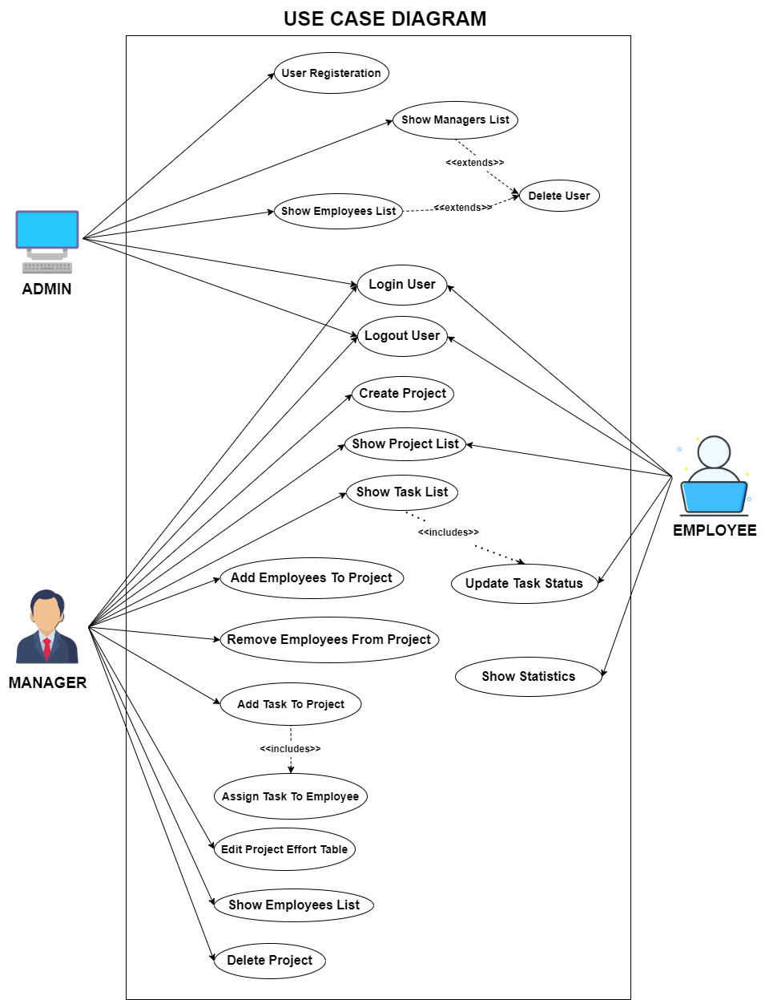
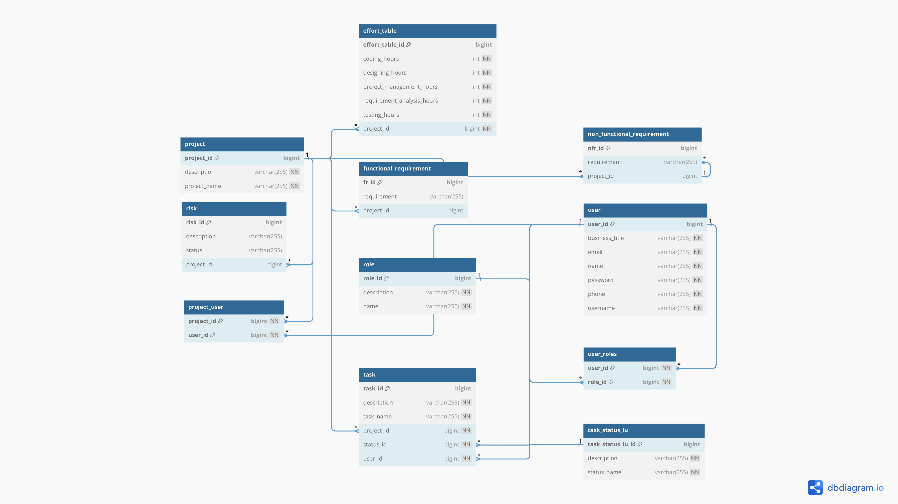
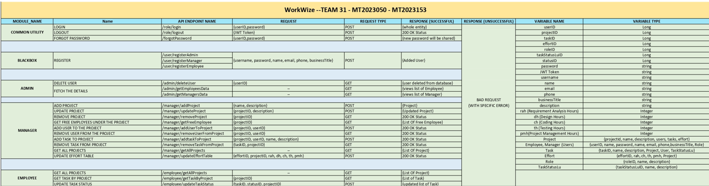

# WorkWize - Industrial Project Management Platform

## Back End
### [Front End Repository](https://github.com/ARJUN1220/SPE_frontend)
## Table of Contents

1. [Problem Statement](#problem-statement)
2. [Application Features](#application-features)
3. [Tool Stack](#tool-stack)

---

## Problem Statement

In industrial settings, traditional methods of project management often lack efficiency and responsiveness, characterized by manual processes and disjointed workflows. Existing project management systems may not adequately address the needs of industrial projects, leading to challenges in project coordination, task assignment, and progress tracking. Additionally, there is a growing demand for platforms that can accommodate user feedback and updates in real-time.

The project "WorkWize" aims to address these challenges by developing a comprehensive project management platform tailored for industrial settings. The primary objective is to provide a streamlined and intuitive solution that enhances project workflows and facilitates effective project management by all stakeholders.

---

## Application Features

### Roles:

1. **Employee:**
   - **Role Description:** Employees execute assigned tasks within projects under the guidance of managers.
   - **Functionalities:**
     - Tasks Related:
       - View Assigned Tasks
       - Update Task Progress
       - Visualize Personal Progress
     - View Profile:
       - View personal details
       - View task history
     - Reset Password:
       - Request password reset
       - Set new password

2. **Manager:**
   - **Role Description:** Managers oversee projects and task assignments, ensuring smooth workflow and project progress.
   - **Functionalities:**
     - Create Project:
       - Create new projects
       - Assign to employees
     - Update Project:
       - Edit existing projects
       - Add or remove tasks, employee from projects
     - Delete Project:
       - Delete Project from the System
     - Project Progress Monitoring
     - Time Distribution Management
     - Effort Distribution Visualization
     - Reset Password:
       - Request password reset
       - Set new password

3. **Admin:**
   - **Role Description:** Administrators have the highest level of access and are responsible for managing users, including adding and removing employees and managers, as well as overseeing the overall system administration.
   - **Functionalities:**
     - Manage Users:
       - Add new users
       - View user profiles
       - Edit user profiles
       - Delete user accounts
     - System Administration:
       - Handle system configurations
       - Perform maintenance tasks
       - Address technical issues and escalations

---

## Diagrams

### Use Case Diagram

### DB Design

### API Documentation

---

## Tool Stack

### Front End:
- Angular JS

### Back End:
- Framework:
  - Spring Boot
- Database:
  - MySQL

### DevOps Tool:
- GitHub: Version control and collaboration
- Jenkins: Automation for building, testing, and deployment
- Docker: Containerization for application management
- Ansible: Automation for configuration and deployment
- ELK Stack: Log management and analysis

---

### Created by:
- MT2023153 - Arjun Gangani [Arjun.Gangani@iiitb.ac.in](mailto:Arjun.Gangani@iiitb.ac.in)
- MT2023050 - Vraj Naik [Vraj.Naik@iiitb.ac.in](mailto:Vraj.Naik@iiitb.ac.in)

### Guided by:

- Prof. B. Thangaraju [B.Thangaraju@iiitb.ac.in](mailto:B.Thangaraju@iiitb.ac.in)

### Assisted by:
- MT2019075 - Samaksh Dingra [Samaksh.Dhingra@iiitb.ac.in](mailto:Samakash.Dhingra@iiitb.ac.in)
---

